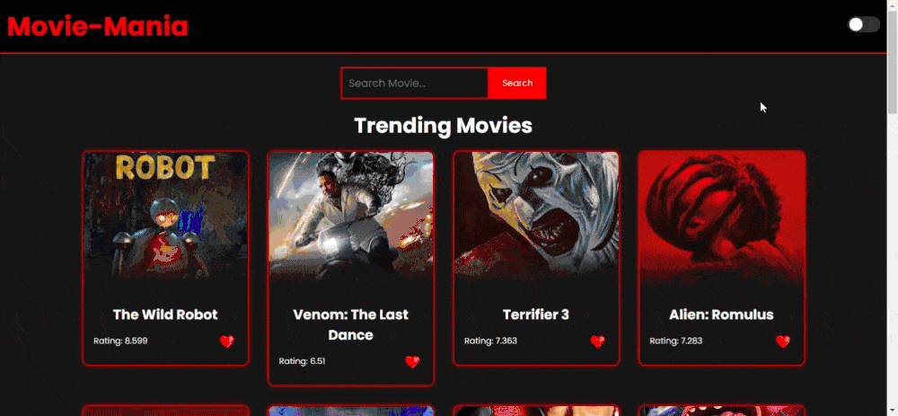

---

# Movie-Mania

Movie-Mania is a responsive web application that allows users to explore popular movies, browse by categories, search for favorites, view detailed movie information, and create a personalized watchlist. Users can also toggle between light and dark modes for a more comfortable viewing experience.

## Table of Contents
- [Features](#features)
- [Demo](#demo)
- [Tech Stack](#tech-stack)
- [Installation](#installation)
- [Usage](#usage)
- [Project Structure](#project-structure)
- [License](#license)

## Features
- **Trending Movies**: Display of popular trending movies.
- **Categories**: Filter movies by categories like Action, Comedy, and Drama.
- **Search**: Search functionality to find movies by title.
- **Watchlist**: Add and remove movies from a personal watchlist.
- **Dark/Light Mode**: Toggle between dark and light themes for enhanced viewing comfort.
- **Movie Details**: View details of each movie, including trailers and ratings.

## Demo


## Tech Stack
- **HTML**
- **CSS**
- **JavaScript**
- **TMDb API**: Used for fetching movie data.

## Installation
1. **Clone the repository:**
   ```bash
   git clone https://github.com/Vikitohyah/Movie-Mania

2. Navigate to the project directory:

cd movie-mania


3. Create a TMDb account and get an API key:

Visit The Movie Database (TMDb) and create an account.

Generate an API key from the developer settings.


4. Configure API key:

Open script.js and replace YOUR_API_KEY with your actual TMDb API key:

const API_KEY = 'YOUR_API_KEY';


Usage

1. Open the project locally:

Open index.html in a web browser.


2. Interact with the app:

Use the search bar to find movies.

Click on movies to view details and trailers.

Add movies to your watchlist using the heart icon.

Toggle between dark and light themes using the switch in the header.


Project Structure

movie-mania/
│
├── index.html                # Main HTML file
├── style.css                 # Main CSS file
├── script.js                 # Main JavaScript file
├── README.md                 # Documentation
└── assets/                   # gif


License

This project is licensed under the MIT License.


---


